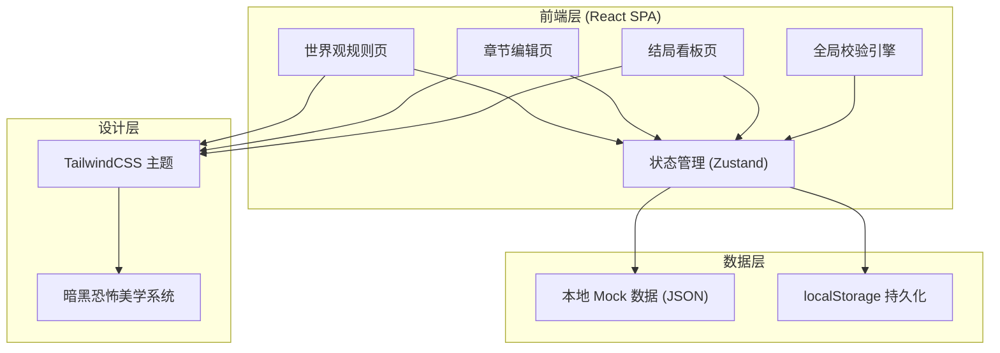
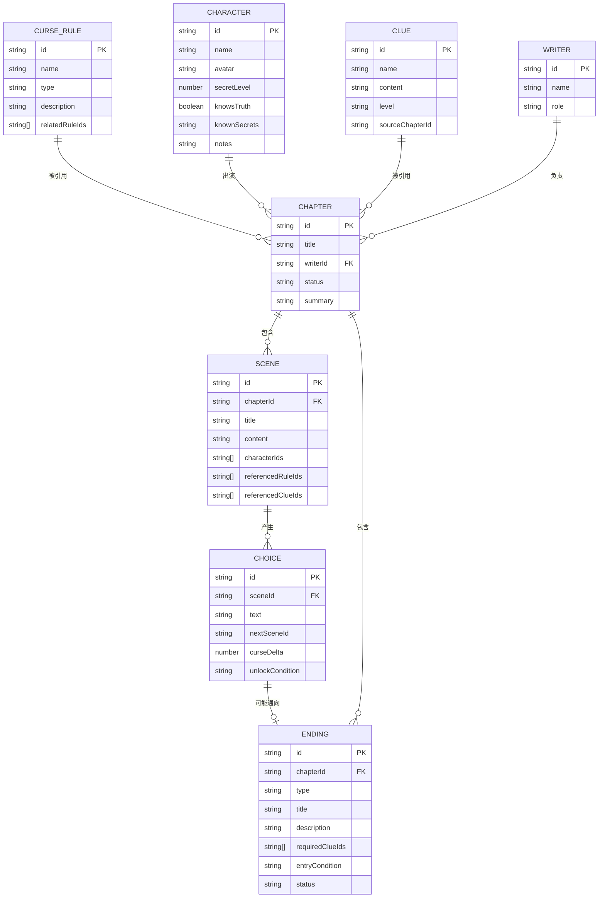

## 1. 架构设计



## 2. 技术说明

- **前端框架**：React@18 + TypeScript
- **构建工具**：Vite@5
- **样式方案**：TailwindCSS@3 + 自定义 CSS 变量（暗黑恐怖主题）
- **状态管理**：Zustand（轻量级 store，管理规则/章节/结局全局状态）
- **路由**：React Router DOM@6
- **图标**：Lucide React（线性极简图标）
- **后端**：无后端，使用 localStorage 持久化 + Mock 数据
- **字体**：Google Fonts - Cinzel（哥特衬线标题）+ JetBrains Mono（等宽正文）

## 3. 路由定义

| 路由 | 页面用途 |
|------|----------|
| `/` | 世界观规则页（诅咒机制、角色档案、怪谈线索） |
| `/chapters` | 章节编辑页（含权限控制、场景/分支编辑器、校验面板） |
| `/endings` | 结局看板（四类结局分类展示与路线详情） |

## 4. 数据模型

### 4.1 ER 图



### 4.2 TypeScript 类型定义

```typescript
type RuleType = 'spread' | 'deepen' | 'release' | 'other';
type SecretLevel = 0 | 1 | 2 | 3; // 0=不知情 1=猜测 2=部分知情 3=完全知晓
type ClueLevel = 'F' | 'E' | 'D' | 'C' | 'B' | 'A' | 'S';
type ChapterStatus = 'draft' | 'writing' | 'review' | 'done';
type EndingType = 'true' | 'bad' | 'loop' | 'hidden';
type EndingStatus = 'pending' | 'approved' | 'rejected';
type UserRole = 'lead' | 'writer' | 'viewer';

interface CurseRule {
  id: string;
  name: string;
  type: RuleType;
  description: string;
  relatedRuleIds: string[];
  createdAt: number;
}

interface Character {
  id: string;
  name: string;
  avatar?: string;
  secretLevel: SecretLevel;
  knowsTruth: boolean;
  knownSecrets: string;
  notes: string;
}

interface Clue {
  id: string;
  name: string;
  content: string;
  level: ClueLevel;
  sourceChapterId?: string;
}

interface Writer {
  id: string;
  name: string;
  role: UserRole;
}

interface Choice {
  id: string;
  sceneId: string;
  text: string;
  nextSceneId?: string;
  endingId?: string;
  curseDelta: number;
  unlockCondition?: string;
}

interface Scene {
  id: string;
  chapterId: string;
  title: string;
  content: string;
  characterIds: string[];
  referencedRuleIds: string[];
  referencedClueIds: string[];
  choices: Choice[];
}

interface Chapter {
  id: string;
  title: string;
  writerId: string;
  status: ChapterStatus;
  summary: string;
  scenes: Scene[];
}

interface Ending {
  id: string;
  chapterId: string;
  type: EndingType;
  title: string;
  description: string;
  requiredClueIds: string[];
  entryCondition: string;
  status: EndingStatus;
}

interface ValidationIssue {
  id: string;
  type: 'error' | 'warning' | 'info';
  category: 'curse' | 'character' | 'foreshadowing' | 'other';
  message: string;
  suggestion?: string;
  sceneId?: string;
  choiceId?: string;
}

interface AppState {
  currentUserId: string;
  rules: CurseRule[];
  characters: Character[];
  clues: Clue[];
  writers: Writer[];
  chapters: Chapter[];
  endings: Ending[];
  validationIssues: ValidationIssue[];
}
```

## 5. 校验引擎规则

- **诅咒违背检测**：检查分支后果是否符合 `CurseRule` 中的传播/加深/解除规则
- **角色泄密检测**：检查场景对话中是否出现 `secretLevel` 不足的角色说出了超出其知情范围的内容
- **铺垫完整度检测**：检查结局所需线索 `requiredClueIds` 是否已在之前章节中被引用或揭示
- **逻辑连通性检测**：检查章节内场景跳转是否形成死路或孤岛
