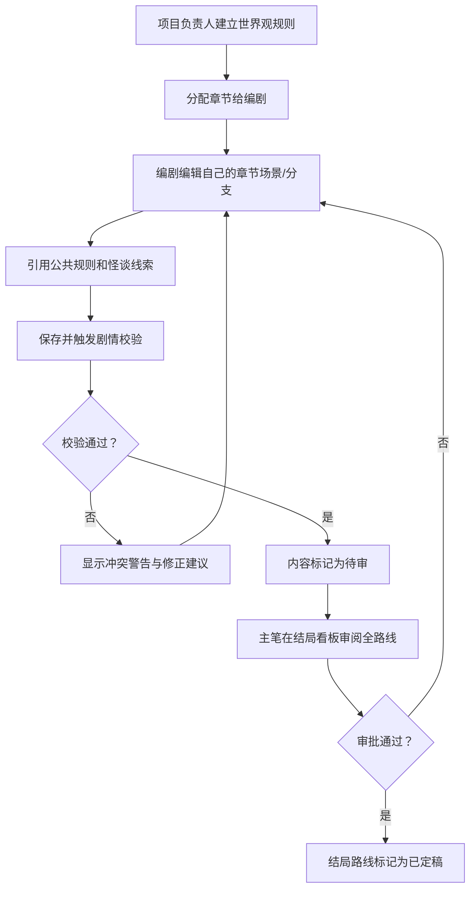

## 1. 产品概述

一款面向叙事恐怖游戏制作组的轻量级 Web 协作工作台，聚焦多人协作编写"分支诅咒剧情"时最容易出现的口径混乱问题。项目负责人建立统一的世界观规则（诅咒传播机制、行为加深条件、角色知情范围），将章节分配给各编剧；编剧在受限的编辑权限下撰写场景与分支，保存时系统自动校验剧情一致性；主笔通过结局看板审阅全部路线，减少后期大规模返工。

## 2. 核心功能

### 2.1 用户角色

| 角色 | 说明 | 核心权限 |
|------|------|----------|
| 项目负责人（主笔） | 项目统筹者 | 建立/编辑世界观规则，分配章节，查看全部内容，审批结局 |
| 编剧 | 负责特定章节的撰写 | 仅编辑被分配的章节，引用公共规则和怪谈线索，查看自己章节的校验结果 |
| 只读成员 | 审稿/美术参考 | 浏览所有页面但不可编辑 |

### 2.2 功能模块

1. **世界观规则页**：诅咒传播规则、行为加深机制、角色知情档案、怪谈线索登记
2. **章节编辑页**：章节列表与分配、场景编辑器、分支选择项、诅咒后果配置、实时剧情校验反馈
3. **结局看板**：按结局类型（真结局/坏结局/循环结局/隐藏结局）分类展示，显示进入条件和路线图

### 2.3 页面详情

| 页面名称 | 模块名称 | 功能描述 |
|----------|----------|----------|
| 世界观规则页 | 诅咒规则卡片 | 诅咒传播条件、加深行为、解除方式的增删改查，规则间可建立关联 |
| 世界观规则页 | 角色档案 | 角色基本信息、是否知道诅咒真相、知情程度、秘密等级标记 |
| 世界观规则页 | 怪谈线索库 | 可被编剧引用的公共线索登记，含线索等级和出处 |
| 章节编辑页 | 章节侧栏 | 显示全部章节，标注分配状态和负责人，点击切换 |
| 章节编辑页 | 场景编辑器 | 富文本场景描述，可插入角色对话、引用规则和线索 |
| 章节编辑页 | 分支选项 | 选项文字、跳转目标、诅咒值变化、解锁条件配置 |
| 章节编辑页 | 校验反馈面板 | 保存时实时检测：违背诅咒设定 ✓/✗、角色泄密警告、结局铺垫不足提示 |
| 结局看板 | 结局分类卡 | 四象限布局展示四类结局数量与状态 |
| 结局看板 | 路线详情 | 展开查看某结局的进入条件、涉及章节、铺垫线索完整度 |

## 3. 核心流程

项目负责人先在世界观规则页定义诅咒机制、角色秘密和公共线索 → 将章节分配给对应编剧 → 编剧进入自己的章节页，编辑场景、选择项和诅咒后果，随时可引用公共规则 → 保存内容时系统自动校验并高亮冲突项 → 主笔在结局看板按类型审阅全部路线，标记完成状态或退回修改。

## 4. 用户界面设计

### 4.1 设计风格

- **主色调**：深墨黑 `#0a0a0c` 背景 + 血红 `#8b0000` 强调色 + 枯骨灰 `#6b6b6b` 次级文字
- **辅助色**：幽绿 `#2d5a3d`（真结局标识）、暗紫 `#3d2d5a`（循环结局标识）、焦橙 `#5a3d2d`（坏结局标识）、冷银 `#8a8a9a`（隐藏结局标识）
- **视觉元素**：细噪点纹理背景、微弱的呼吸式红色光晕、轻微摇晃的标题动效、血滴式分割线
- **按钮风格**：方角、细边框、悬停时边框向内渗出红光、按下时轻微下陷
- **字体**：标题用哥特感衬线 "Cinzel"，正文用等宽感无衬线 "JetBrains Mono"
- **布局**：三栏式主布局（左侧导航 / 中间内容 / 右侧校验面板），卡片式模块，整体紧凑压抑
- **图标风格**：线性极简图标，带微弱发光效果，避免可爱风格

### 4.2 页面设计概览

| 页面名称 | 模块名称 | UI 元素 |
|----------|----------|----------|
| 世界观规则页 | 规则卡片 | 暗黑卡片、血红强调边框、规则标签带发光效果、展开时缓慢下推动画 |
| 世界观规则页 | 角色档案 | 头像为暗剪影、秘密等级用红点数表示、悬停显示秘密摘要 |
| 章节编辑页 | 编辑器 | 深底浅字、光标带红色拖尾、引用规则时插入绿色发光标签 |
| 章节编辑页 | 校验面板 | 错误项血红高亮并带脉冲动画、警告项焦橙、正确项幽绿 |
| 结局看板 | 分类卡 | 四色象限卡、数字用大号哥特字体、悬停微上浮 + 阴影加深 |
| 结局看板 | 路线详情 | 时间线式布局、节点用发光圆点、虚线连接表示分支 |

### 4.3 响应式设计

桌面端优先（≥1280px 三栏布局），平板端（768-1279px）折叠为左右两栏，移动端（<768px）单栏堆叠，导航转为顶部抽屉。
